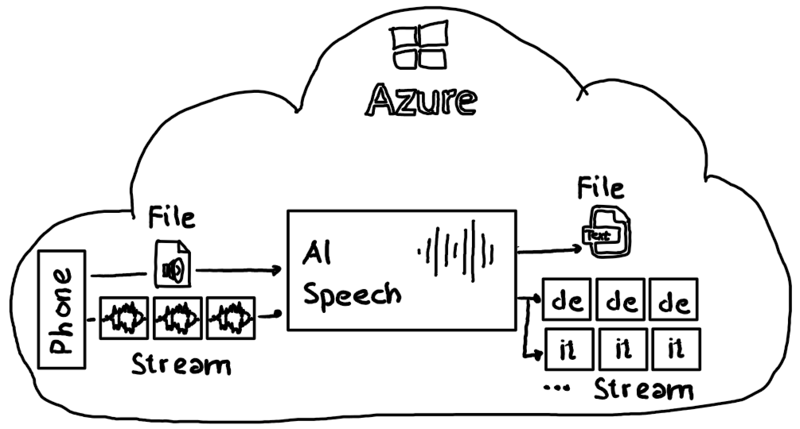

# AI Speech | Translation

## File & Stream Translation

Azure AI Speech offers advanced capabilities for transcribing and translating voice inputs. Not only can it handle audio files, but it also supports real-time audio streams. This means it can transcribe and translate incoming audio streams into multiple languages simultaneously, providing a versatile solution for various applications.



## Stream translation

This GitHub repository showcases a streamlined end-to-end solution that processes an incoming English audio stream and translates it in near real time into both German and Italian output streams. The solution leverages an instance of [Azure AI Speech](https://azure.microsoft.com/en-us/products/ai-services/ai-speech) to provide it's functionality.


1. The [client](./src/client/) application posts an English audio stream to the [server](./src/server/) REST api listening on port 8080.
2. The [server](./src/server/) directly injects the audio stream into an Azure AI Speech instance and asks for a German and Italian translation.
3. The Azure AI Speech instance performs transcription and translation of the incoming audio stream and provides results as stream to the [server](./src/server/)
4. The [server](./src/server/) forwards the translated text (German and Italian) to the [visualizer](./src/visualizer/) which shows the text stream on the console.

## Setup demo environment

Execute this [Azure CLI script](./setup/setup.azcli) to setup an Azure AI Speech instance, retrieve authentication and endpoint information and store them in  `./config/application.env` for usage by the [server](./src/server/).

## Execute demo

### Terminal Window

Clone the repo and execute ***each in a new terminal window*** in the respective project folder:

- ```dotnet run --project ./visualizer.csproj```
- ```dotnet run --project ./server.csproj```
- ```dotnet run --project ./client.csproj```

In the terminal window of the ***visualizer*** you will see the German and Italian translation:


### Visual Studio Code

Clone the repo and open it in VSCode. `Run and Debug` provides the option ***Launch: visualizer, server and cli*** to start the three applications in the correct sequence.

